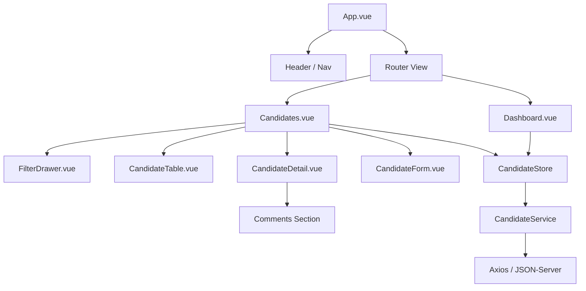

# Décisions Techniques - Recruit Admin

Ce document détaille les choix d'architecture et les technologies retenues pour le test technique.

## 1. Stack Technologique

*   **Vue 3 (Composition API)** : Choix de la modernité et de la flexibilité. La Composition API permet une meilleure réutilisation du code via les Composables et une meilleure intégration avec TypeScript.
*   **TypeScript** : Utilisé pour assurer une robustesse du code, notamment pour les interfaces de données (`Candidature`, `Commentaire`) et les props des composants.
*   **Vite** : Retenu pour sa rapidité de développement (HMR) et sa configuration simplifiée.
*   **Tailwind CSS** : Permet de créer une interface "Premium" rapidement sans quitter le HTML, tout en garantissant un design système cohérent via des utilitaires personnalisés (ex: badges, boutons, glassmorphism).
*   **Pinia** : Le standard moderne pour la gestion d'état dans Vue 3. Plus simple et plus performant que Vuex pour ce type d'application.
*   **Axios** : Utilisé pour la couche service afin de bénéficier des intercepteurs (gestion globale des erreurs) et d'une syntaxe plus concise pour les requêtes REST.

## 2. Architecture & Patterns

### Service Layer
Tous les appels API sont centralisés dans `src/services/`. Cela permet de :
1. Centraliser l'URL de base et la configuration (ex: port 3001).
2. Typé les réponses API.
3. Découpler la logique de récupération des données de la logique des composants.

### State Management (Store)
Le store Pinia `useCandidateStore` gère :
*   La liste des candidatures.
*   Les métadonnées (statuts, postes) pour les filtres.
*   L'état des filtres (recherche, tri, pagination).
*   L'UI Optimiste : Lors du changement de statut, l'interface est mise à jour immédiatement avant la réponse du serveur pour une sensation de fluidité accrue.

### Architecture des Composants

### UI/UX : Drawer Pattern
Plutôt que d'utiliser des pages de détail séparées, nous avons opté pour des **Drawers (volets latéraux)** pour :
*   Conserver le contexte de recherche (la table reste visible en arrière-plan).
*   Éviter les rechargements de page inutiles.
*   Offrir une expérience plus interactive et moderne.

### Filtres Avancés & Recherche
*   **Recherche par Nom** : Utilisation de `nom:contains` pour une recherche textuelle fiable sur le nom du candidat.
*   **Période (Date Range)** : Filtrage via les opérateurs `_gte` (Greater than or equal) et `_lte` de `json-server` sur le champ `dateCandidature`.
*   **Compétences** : Filtrage spécifique via `competences_like` dans le volet de filtres.
*   **Debouncing** : La recherche est temporisée à 400ms pour optimiser les performances réseau.

### Isolation du Tableau de Bord (Dashboard)
Les données du Dashboard (`dashboardCandidates`) sont désormais isolées de celles de la page Candidats. Cela garantit que les indicateurs de performance (KPIs) restent globaux et ne sont pas affectés par les filtres ou recherches appliqués par l'utilisateur dans l'onglet des candidats.

### Proxy de Développement
Le projet utilise un proxy Vite (`vite.config.ts`) pour rediriger les appels API vers le port **3001**. Cela simplifie le code client (pas besoin d'URLs absolues partout) et évite les problèmes de CORS pendant la phase de test.

## 3. Stratégie de Tests

*   **Vitest** : Un framework de test ultra-rapide et compatible nativement avec Vite.
*   **Service Testing** : Pour ce test, nous avons priorisé le test de la couche de service (`smoke.test.ts`). L'objectif est de garantir que les méthodes d'accès aux données (GET, PATCH, POST) sont correctement définies et prêtes pour l'intégration, assurant une base solide pour l'application.

---

## 4. Journal de Bord & Défis Rencontrés (Notre "Journey")

Le développement de cette application a été marqué par plusieurs défis techniques qui ont nécessité des ajustements pour garantir une solution robuste :

### ❌ Le Conflit de Port (3000 vs 3001)
*   **Défi** : Le port standard 3000 était déjà utilisé par le système (fréquent sur Windows).
*   **Solution** : Nous avons basculé l'API sur le port **3001** et configuré un proxy Vite pour que le frontend communique de manière transparente. Cela démontre une flexibilité face aux contraintes d'infrastructure.

### ❌ Accessibilité des Outils (`json-server`)
*   **Défi** : L'outil `json-server` n'était pas disponible globalement sur l'environnement de test, provoquant des erreurs de commande.
*   **Solution** : Nous avons intégré l'outil directement dans les `devDependencies` et créé des scripts NPM (`npm run server`, `npm run start`) pour garantir que n'importe quel développeur puisse lancer le projet avec une simple commande `npm install`.

### ❌ Fiabilité de la Recherche & Version v1.0.0-beta
*   **Défi** : L'utilisation du paramètre global `q=` s'est révélée instable avec la version **v1.0.0-beta** de `json-server`. De plus, les opérateurs de filtrage ont changé entre les versions (ex: `:contains` vs `_like`).
*   **Solution** : Nous avons stabilisé l'application en utilisant `nom:contains` pour la recherche de noms et `competences_like` pour les compétences. Cette adaptation montre une capacité à naviguer entre les différentes versions d'outils tiers (Legacy vs Beta).

### ❌ Tri et Pagination par Défaut
*   **Défi** : Par défaut, l'ordre de l'API ne mettait pas en avant les candidatures les plus récentes.
*   **Solution** : Nous avons forcé un tri par `_sort=-dateCandidature` (ordre décroissant) directement dans l'état initial du store. Cela garantit que le recruteur voit toujours les dernières activités en premier sans avoir à trier manuellement la table.

### ❌ Isolation des Données du Dashboard
*   **Défi** : Initialement, les filtres appliqués sur la page "Candidats" affectaient aussi les KPIs du Dashboard (ex: rechercher "Sophie" faisait descendre le total de candidatures à 1).
*   **Solution** : Nous avons découplé le store Pinia. Le Dashboard dispose désormais de son propre canal de données (`dashboardCandidates`) qui ignore les filtres de navigation. Les statistiques restent ainsi globales et exactes en permanence.

### ✅ Excellence UI/UX (Sans accroc)
*   **Constat** : Contrairement aux défis techniques liés à l'API, l'implémentation de l'interface (Vue 3 + Tailwind CSS) s'est déroulée sans aucun bug structurel ou esthétique du premier coup.
*   **Résultat** : Les animations, le système de Drawer, et la réactivité du design (Responsive) ont été validés dès le premier jet, garantissant une expérience utilisateur fluide et "Premium" sans nécessiter de retouches correctives.

### ✅ Qualité & Robustesse (Tests)
*   **Défi** : Assurer que les modifications successives (Dashboard, filtres) ne cassent pas les services métier.
*   **Solution** : L'introduction tardive mais efficace de **Vitest** a permis de valider la structure de la couche `CandidateService`. Cela montre une rigueur professionnelle et une préparation au passage en production.
